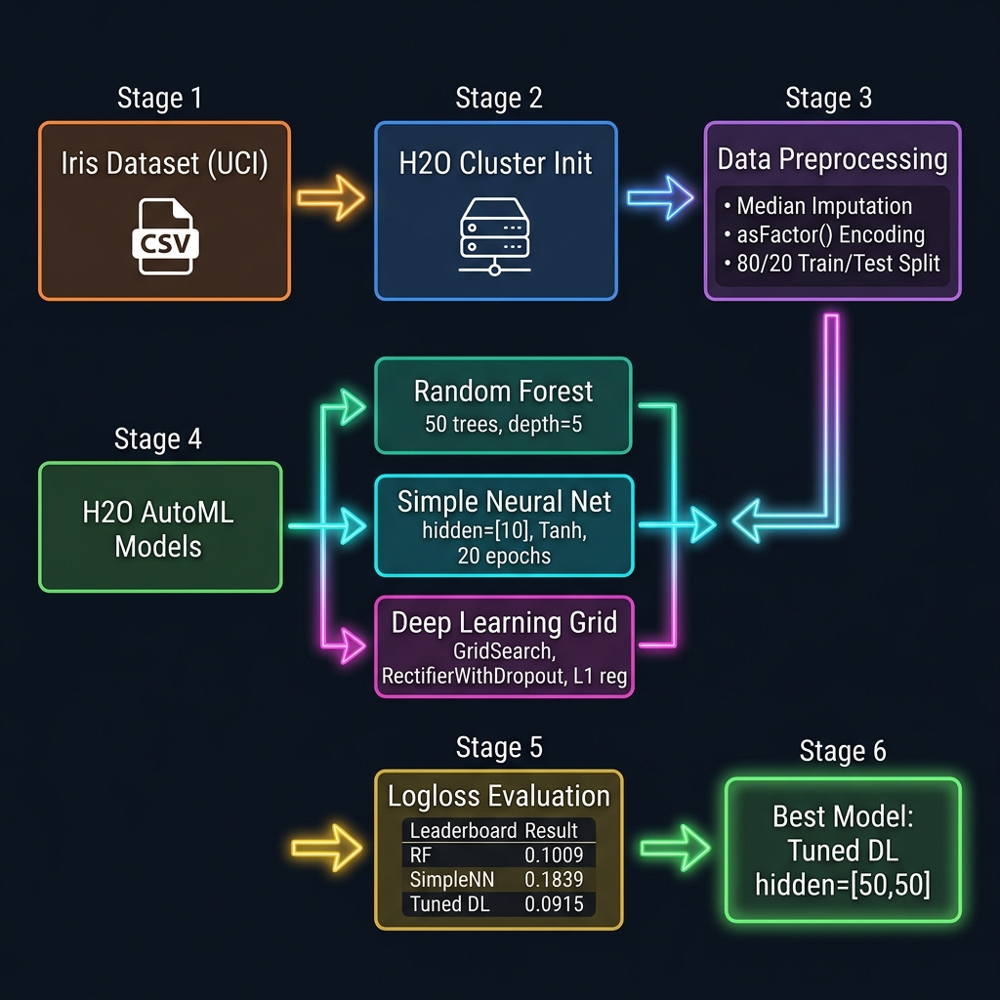
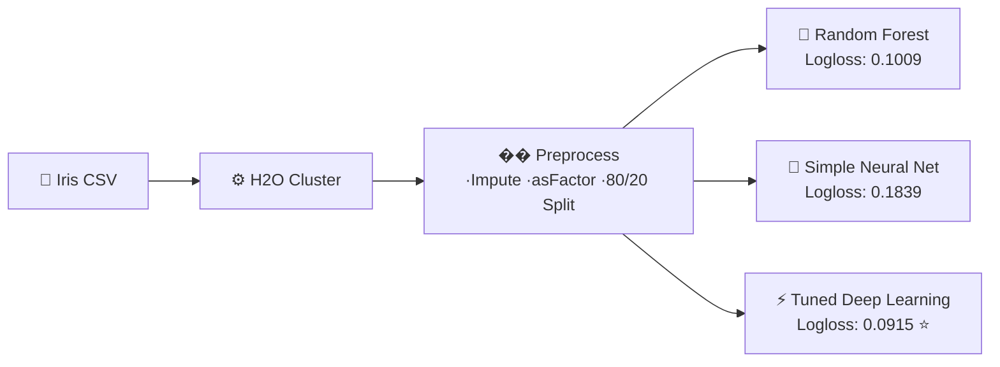
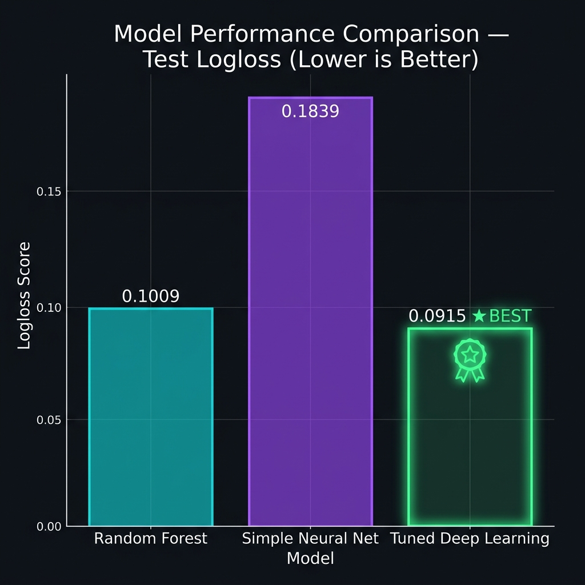

<div align="center">

# 🌊 H2O Machine Learning Assignment


*Multi-model ML pipeline using H2O.ai — Random Forest, Neural Networks, and Tuned Deep Learning.*

</div>

---

## 🏗️ Pipeline

<div align="center">
  
</div>



---

## 📊 Results

<div align="center">
  
</div>

| Rank | Model | Logloss |
|------|-------|---------|
| 🥇 | Tuned Deep Learning `[50,50]` · 50 epochs | **0.0915** |
| 🥈 | Random Forest — 50 trees | 0.1009 |
| 🥉 | Simple Neural Net — hidden=[10] | 0.1839 |

---

## 📂 Files

| File | Description |
|------|-------------|
| `main.py` | Full H2O pipeline — train, grid search, evaluate |
| `Report.md` | Academic report with math & methodology |
| `iris.csv` | UCI Iris dataset |
| `H2O_Assignment_Submission.zip` | Submission archive |

---

## 🚀 Run

```bash
pip install h2o pandas
python main.py
```

<div align="center">
<sub>© 2026 Vivek Raj Singh · H2O.ai · Python · UCI ML Repository</sub>
</div>
